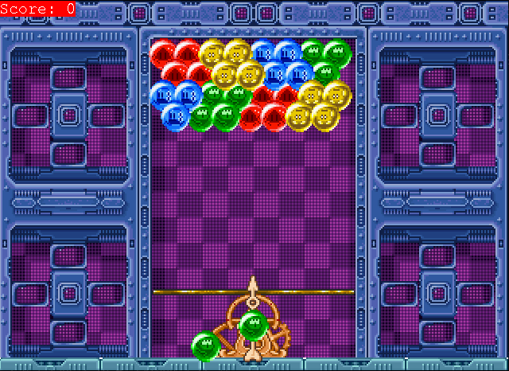

# Puzzle Bobble (1994)
This repository is an attemp to replicate the original game.
It is a simplified version of the original, not meant to be a full copy, but just a concept to apply the patterns learned. However, it's fully playable and contains 30 levels.



Sprites source: https://www.spriters-resource.com/arcade/bustamovepuzzlebobble/

Many settings of the game can be changed in `settings.py` (located inside the `utils` folder)

## Authors
Pompeu Costa, Márcio Tavares

## Patterns used
### Command
We used the command pattern to transform player inputs into game actions.
Ex:

```py
self._input_handler = InputHandler()
self._input_handler.bind_command(Shoot(self),pygame.K_SPACE)
self._input_handler.bind_command(Rotate(self,Direction.LEFT),pygame.K_LEFT)
self._input_handler.bind_command(Rotate(self,Direction.RIGHT),pygame.K_RIGHT)
```

This example is part of the bubble shooter.
This sets the space key to trigger a shoot command, and the left and right arrow keys to handle the rotation of the shooting direction.

```py
prev_command, next_command, select_command = Previous(self), Next(self), Select(self)
self._input_handler = InputHandler()
self._input_handler.bind_command(prev_command, pygame.K_UP)
self._input_handler.bind_command(next_command, pygame.K_DOWN)
self._input_handler.bind_command(select_command, pygame.K_RETURN)
```

Another example is part of the menus, where the up and down arrow keys are used to navigate through the menu options and the return key (enter) is used to select an option.

### Flyweight
We used the flyweight pattern for bubble sprites.
We get the sprites once when the game starts and store them in a dictionary.
When a new bubble is spawned, it gets the sprite from that dictionary.

Loading the bubble sprites and storing them (`play_state.py`)

The variable *`bubble_sprites`* is globally accessible (`colors.py`). Although not ideal, but we only write to it in the function below.
```py
def _load_bubbles(self):
    bubbles = join("sprites","bubbles.png")
    sheet = SpriteSheet(bubbles)

    COLORS = [BubbleColor.BLUE,BubbleColor.RED,BubbleColor.PURPLE,BubbleColor.BLACK,
                BubbleColor.YELLOW,BubbleColor.GREEN,BubbleColor.ORANGE,BubbleColor.GRAY]
    CELL_SIZE = 32
    for row,color in enumerate(COLORS):
        # 7 sprites per color (the first is the bubble itself, the others are the pop animation)
        rects = [(col * CELL_SIZE,row * CELL_SIZE,CELL_SIZE,CELL_SIZE) for col in range(0,7)]
        sprites = sheet.images_at(rects,-1)
        bubble_sprites[color] = sprites
```

Getting the sprites from the dictionary (`bubble.py`)
```py
self._sprites = bubble_sprites[color]
self.set_image(self._sprites[0])
```

### Observer
We use the observer pattern a lot throughout the components.
Component A has an internal list that stores the callbacks and a function to register a callback for that event.
Component B, that wants to do something when an event occurs in component A, registers its callback by calling the register function of component A.

Example of a register function (`bubbleShooter.py`)
```py
def register_on_shoot_event(self,callback):
    self._on_shoot_callbacks.append(callback)
```

When the bubble shooter receives a shoot command (`bubbleShooter.py`)
```py
def shoot(self):
    for callback in self._on_shoot_callbacks:
        callback(self._shootDir)
```

The registration (`play_state.py`) 
```py
self._bubbleShooter.register_on_shoot_event(self.arena.shooter_shoot_handler)
```

### State
There are two components that use states. Bubbles and Game.

We use states in bubbles because they can be in multiple states (`bubbleStates.py`):
- `Idle` (the shooter or next bubbles, or the grid bubbles), meaning they are doing nothing.
Just waiting for an event that changes their state to happen.
- `Shot`, ie. when the arena receives the shoot command from the shooter, the bubble enters the shot state, meaning it is traveling in the arena but not on the grid.
This state handles the moving physics.
- `Floating`, ie. when neighbouring bubbles are poped and the bubble is not attached to anything, then it enters the floating state, so it falls down the arena for a certain duration until it pops.
This state handles the falling physics and tracks the duration of the state.
- `Pop`, ie. when 3 or more bubbles of the same color are attached to each other, they pop. This state handles the pop animation.

We use states in game because the player can be in the start menu, playing or in the game over menu.
Each state extends the abstract class `GameState` and implements the abstract methods `handle_input`, `update`, `draw` and `next_state`.
We also have a generic menu state that is extended by the start menu and game over menu states.
- `PlayState`, the main game state, where the player plays the game.
- `MenuState`, the generic menu state that shows information and handles the navigation between the options.
- `StartMenuState`, the state where the player can start the game or exit.
- `GameOverMenuState`, the state where the player can play again, go to the start menu or exit.

### Double Buffer
Very self explanatory. We use the `pygame.display.flip()` (`play_state.py`)

### Game loop
Very self explanatory.
We use the `handle_input` -> `update` -> `draw` (`main.py`)

### Component
By leveraging the observer pattern, we managed to make most of the game by joining components.
For example, the grid, arena and the bubble shooter aren't tightly coupled together. Although the arena requires a grid, to work properly, there are no strict requirements for a hexagonal grid.
We could have implement an abstract class "grid" that forces derived classes to implement certain functions (`add_bubble`, `get_present_colors`, `update`, `move_down`, ...).

Although not very coupled, the bubbles are somewhat coupled with some components (arena,grid and score), but the same logic with the grid could be applied.
For example, the score class needs to know the color of the bubble to calculate the score.
```py
def __init__(self) -> None:
    self._score = 0
    self._color_to_points = {
        BubbleColor.RED: 1,
        BubbleColor.GREEN: 2,
        BubbleColor.BLUE: 3,
        BubbleColor.YELLOW: 4,
        BubbleColor.BLACK: 5,
        BubbleColor.GRAY: 6,
        BubbleColor.PURPLE: 7,
        BubbleColor.ORANGE: 8 
    }

def handle_bubble_pop(self,bubble: Bubble):
    points = self._color_to_points.get(bubble.color,None)
    if  points != None:
        self._score += points
    else:
        print(f"[SCORE] unknown color {str(bubble.color)}")
```

## Other implemented techniques
### Level Loader and Level Files
We implemented a level loader that have a list of available levels and keeps track of the current level.

The available levels are all the json files in the `levels` folder with the name format `lvl_x.json`.
The json files contains the width and height of the grid and, for each bubble color, the positions where they should be placed.
The positions are in the format `[row, col]`.

Example of a level file:
```json
{
    "width": 15,
    "height": 15,
    "bubbles": {
        "RED": [[0, 0]],
        "GREEN": [[0, 2]],
        "BLUE": [[0, 4]],
        "YELLOW": [[0, 6]],
        "BLACK": [[0, 8]],
        "GRAY": [[0, 10]],
        "PURPLE": [[0, 12]],
        "ORANGE": [[0, 14]]
    }
}
```

### Bubble snap to grid logic
When a bubble collides with the grid, it snaps to a position in the grid.
This is done by the method `_pixel_to_hex` in the `hex_grid.py` file, responsible for converting a pixel into a grid position.

Here is a breakdown of the method:
1. Convert the pixel position to the arena position.
2. Convert the arena position to the hex position (rounded).
    - If the rounded position is not a valid hex position (row + col must be even), then choose the closest valid hex position between the left and right.
3. Find the first valid position for this grid (should be a empty cell inside the grid).
    - The positions are composed of the original position and its neighbors.
    - The neighbors are sorted by the distance to the arena position (and prioritizes the row distance over the column one).
    - If no valid position is found, then print a panic message (should never happen in normal conditions).

### Bubble pop logic
When 3 or more bubbles of the same color are attached to each other, they pop.
For this, we implemented the following methods (important ones) in the `hex_grid.py` file:
- `get_connected_bubbles`, that returns a list of connected bubbles to a given position with the same color as the provided one. It uses a breadth-first search algorithm.
- `_get_floating_bubbles`, that returns a list of floating bubbles - bubbles that are not attached to the top of the grid.
- `_pop_bubbles_from`, that takes a position and pop all the connected and floating bubbles if they are 3 or more.


